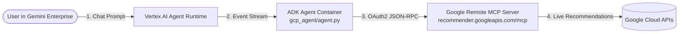

# Google Cloud Remote MCP Bridge to Gemini Enterprise

A production-ready reference architecture connecting official **Google Cloud Remote Model Context Protocol (MCP) servers** to **Gemini Enterprise** using the **Google Agent Development Kit (ADK)** and **Vertex AI Agent Runtime**.

---

### Architecture Overview



### Key Capabilities

- **Native ADK `McpToolset`**: Direct HTTPS connection to Google Cloud's remote MCP servers with dynamic tool discovery (`tools/list`) and automated schema conversion for Gemini.
- **Dynamic Token Management**: Dynamic OAuth2 token refresh via Application Default Credentials (ADC) with automatic `X-Goog-User-Project` injection.
- **Serverless Hosting**: Packaged as a standard container running on **Vertex AI Agent Runtime (Reasoning Engine)**.
- **Automated Fleet Governance**: Automatically cataloged into **Google Cloud Agent Registry** upon deployment.
- **Gemini Enterprise Integration**: Bound directly to your Gemini Enterprise chat application via `agents-cli publish`.

---

## Project Structure

```
google-cloud-mcp-bridge/
├── gcp_agent/            # ADK Agent package
│   ├── __init__.py       # Exports root_agent for ADK loader
│   └── agent.py          # Native ADK Agent using McpToolset & Reasoning Engine routes
├── skills/
│   └── recommender/
│       └── SKILL.md      # Skill instructions for cost and idle resource analysis
├── Dockerfile            # Container image build for Agent Runtime
├── requirements.txt      # Python dependencies (google-adk[mcp,gcp])
├── test_client.py        # Local script to verify ADK McpToolset discovery
├── test_chat.py          # Local script to run conversational prompts via ADK Runner
├── deploy.sh             # Script to deploy to Agent Runtime and publish via agents-cli
└── README.md             # Project documentation
```

---

## Quickstart

### 1. Install `uv` and `agents-cli`

`agents-cli` is Google Cloud's official CLI toolkit for developing, evaluating, and deploying AI agents on Google Cloud. Install it using `uv`:

```bash
# Install uv (if not already installed)
curl -LsSf https://astral.sh/uv/install.sh | sh

# Install agents-cli
uv tool install google-agents-cli

# Verify installation
agents-cli info
```

### 2. Scaffold or Bootstrap the Project with `agents-cli`

If starting a new agent from scratch, you can scaffold it in one command using `agents-cli scaffold create`:

```bash
# Scaffold an ADK Agent targeting Vertex AI Agent Runtime in rapid-prototype mode
agents-cli scaffold create gcp-recommender-agent \
  --agent adk \
  --deployment-target agent_runtime \
  --region us-central1 \
  --prototype
```

Key scaffolding flags:
- `--agent adk`: Targets the official Google Agent Development Kit framework template.
- `--deployment-target agent_runtime`: Configures serverless hosting on Vertex AI Agent Runtime (Reasoning Engine).
- `--prototype`: Enables rapid iteration on agent instructions and tools before generating CI/CD pipelines.

To add deployment configuration to an existing project at any time:
```bash
agents-cli scaffold enhance . --deployment-target agent_runtime
```

The scaffolding metadata is stored in `agents-cli-manifest.yaml`, allowing subsequent CLI commands (`deploy`, `publish`, `run`) to execute seamlessly without redundant parameters.

### 3. Set Up Python Virtual Environment
```bash
# Verify Python version (3.10+)
python3 --version

# Create and activate virtual environment
python3 -m venv .venv
source .venv/bin/activate

# Upgrade pip and install dependencies
pip install --upgrade pip
pip install -r requirements.txt
```

### 4. Configure Google Cloud Project & Enable APIs
```bash
export GOOGLE_CLOUD_PROJECT="your-project-id"
export GOOGLE_CLOUD_LOCATION="us-central1"
gcloud config set project "$GOOGLE_CLOUD_PROJECT"

# Enable all required APIs for Agent Runtime & Agent Registry
gcloud services enable \
  aiplatform.googleapis.com \
  agentregistry.googleapis.com \
  recommender.googleapis.com \
  discoveryengine.googleapis.com \
  artifactregistry.googleapis.com \
  cloudbuild.googleapis.com \
  --project="$GOOGLE_CLOUD_PROJECT"
```

### 5. Test Locally (No Cloud Deployment)

#### Test A: Verify Remote MCP Tool Discovery
```bash
gcloud auth application-default login

python test_client.py
```

#### Test B: Run Conversational Prompts via ADK Runner
```bash
# Enable Vertex AI for LLM reasoning with Application Default Credentials
export GOOGLE_GENAI_USE_VERTEXAI=true

# Run a test prompt
python test_chat.py "What recommendations can you provide for persistent disks?"
```

#### Test C: Visual Browser Chat via `adk web`
```bash
# Start ADK development server with Web UI pointing to gcp_agent
adk web --port 8085 gcp_agent

# Open http://127.0.0.1:8085/dev-ui/ in your browser
```

---

### 6. Deploy to Agent Runtime & Publish to Gemini Enterprise

#### Automated Deployment via Script
```bash
export GOOGLE_CLOUD_REGION="us-central1"
export GEMINI_ENTERPRISE_APP_ID="projects/PROJECT_NUMBER/locations/global/collections/default_collection/engines/APP_ID"

chmod +x deploy.sh
./deploy.sh
```

#### Step-by-Step Deployment via `agents-cli`
Deploy directly to Google Cloud Agent Runtime:

```bash
agents-cli deploy \
  --deployment-target="agent_runtime" \
  --project="$GOOGLE_CLOUD_PROJECT" \
  --region="$GOOGLE_CLOUD_LOCATION" \
  --service-name="gcp-recommender-agent" \
  --service-account="mcp-bridge-agent-sa@${GOOGLE_CLOUD_PROJECT}.iam.gserviceaccount.com" \
  --update-env-vars="ACTIVE_MCP_SERVICE=recommender,GOOGLE_CLOUD_PROJECT=${GOOGLE_CLOUD_PROJECT},GOOGLE_GENAI_USE_VERTEXAI=true,GOOGLE_CLOUD_LOCATION=${GOOGLE_CLOUD_LOCATION}"
```

Check deployment status at any time:
```bash
agents-cli deploy --status
```

#### Automatic Cataloging in Google Cloud Agent Registry
When deployed to Agent Runtime, Google Cloud **automatically catalogs** the agent in Agent Registry:

```bash
gcloud alpha agent-registry agents list \
  --project="$GOOGLE_CLOUD_PROJECT" \
  --location="$GOOGLE_CLOUD_LOCATION"
```

#### Publish to Gemini Enterprise App via `agents-cli`
1. List available Gemini Enterprise apps in your project:
```bash
agents-cli publish gemini-enterprise --list
```

2. Bind the deployed agent to your Gemini Enterprise App:
```bash
agents-cli publish gemini-enterprise \
  --gemini-enterprise-app-id="projects/PROJECT_NUMBER/locations/global/collections/default_collection/engines/APP_ID" \
  --display-name="GCP Recommender Agent" \
  --description="Audits Google Cloud resources and discovers cost optimization recommendations using Google's remote MCP server." \
  --tool-description="Audits Google Cloud resources for idle persistent disks, underutilized VMs, and cost savings." \
  --deployment-target="agent_runtime" \
  --registration-type="adk"
```

*(Or simply run `agents-cli publish gemini-enterprise --interactive` to be guided through app selection interactively!)*

#### Test Deployed Agent via `agents-cli run`
```bash
agents-cli run \
  --mode="adk" \
  "Check for idle persistent disks in project ${GOOGLE_CLOUD_PROJECT} in zone us-central1-a"
```

---

## Switching to Other Google Cloud MCP Services

Set the `ACTIVE_MCP_SERVICE` environment variable to switch to another Google Cloud remote MCP server:

```bash
# Switch to Compute Engine Remote MCP
export ACTIVE_MCP_SERVICE="compute"

# Switch to BigQuery Remote MCP
export ACTIVE_MCP_SERVICE="bigquery"
```
